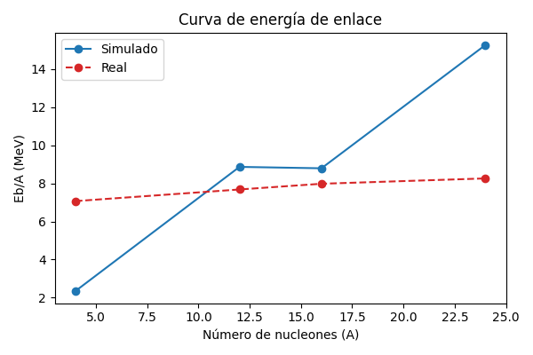

# QA Global – Estabilidad Nuclear (olas 1–4)
## Tabla de la verdad
| Ola | Partícula | Éxitos (filtrados) | Masa Sim (GeV) | Masa Real (GeV) | Precisión (%) | Eb/A Sim (MeV) | Eb/A Real (MeV) |
|-----|-----------|--------------------|----------------|-----------------|---------------|----------------|-----------------|
| Ola 2 | Helium-4 | 9895 | 3.744 | 3.727 | 0.44% | 2.35 | 7.07 |
| Ola 3 | Carbon-12 | 9034 | 11.153 | 11.175 | 0.20% | 8.87 | 7.68 |
| Ola 3 | Oxygen-16 (Tetra) | 8766 | 14.872 | 14.899 | 0.18% | 8.79 | 7.98 |
| Ola 4 | Magnesium-24 | 9033 | 22.152 | 22.341 | 0.85% | 15.26 | 8.26 |

## Curva de estabilidad
